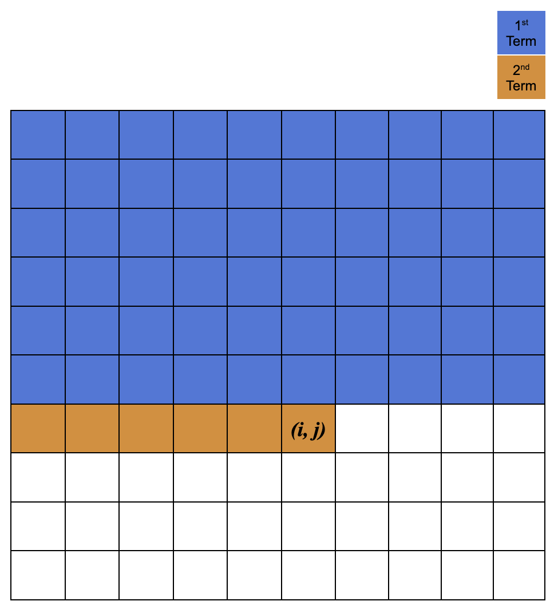

# Introduction

This project aims to implement meta-heuristic search algorithm for image reconstruction outlined in [Zhang, Y.; Wei, W.; Wang, Z. "Progressive Learning Hill Climbing Algorithm with Energy-Map-Based Initialization for Image Reconstruction" 2023 paper](https://doi.org/10.3390/biomimetics8020174). There are two main differences between the traditional hill climbing algorithm and the novel algorithm:

1. Polygons used for image reconstruction is _progressively_ added per generation rather than all at once.
2. Re/initialization of polygons uses energy map as a _meta-heuristic_.

# Installation

To install, clone this repository and install its dependencies.

```
git clone https://github.com/olincollege/scicomp-p3-genos.git
```

## Dependencies:

There are a few dependencies for this project that need to be installed for the code to function.

- Python 3.10+
- Python Libraries:
  ```
  matplotlib
  numpy
  ```
- (Optional) dependencies for other features:
  ```
  imagemagick
  ```

### Nix

Installing these libraies through your prefered method is fine -- I personally use nix :snowflake: to create a nix shell environment to load all dependencies easily from the default.nix file using the command:

```
nix-shell default.nix
```

# Usage (Needs to be fleshed out)

This algoritm can be _very_ memory intensive, even with small images (256x256) and takes a long time to generate even on powerful hardware. The referenced paper uses a "workstation powered by two Intel Xeon Gold 5218R CPUs with 64 GB memory," benchmarks for the implementation of the ProHC-EM algorithm taking about 12 minutes to generate a single output image.

Due to local hardware constraints, we used a remote computing cluster to generate our more computationally complex outputs. Our `runner_script.sh` file is an artifact of this.

## Running Locally

There are many arguments that can be passed into the script to modify the output
of the code. However, to run the default/unchanged version you only need to run:

```
python model.py
```

To learn more about the arguments that can be passed into this model, run:

```
python model.py -h
```

To see more of the step by step processing that is going on under the hood, pass the debug
flag (as shown below) to toggle what information is passed to the output logfiles. To make the output more understandable I
would recommend starting with a low complexity set up.

```
TODO / TBA
python model.py --debug
```

# Procedure

At a higher level, to execute the reconstruction algorithm, we need to provide the following parameters:

- source image
- max number of polygons
- global iteration limit
- stagnation limit

Some terminologies that will be used in the following sections:

- **Polygon**: a closed shape with specified vertices and RGBA values.
- **Solution**: a sequence of polygon(s).
- **Canvas**: a blank image with the same dimension as the source image; a canvas renders a solution that it contains.
- **Generation**: a set of iterations resulting within the same number of polygons -- i.e., optimizations at a given number of polygons.
- **Global iteration**: a single iteration of the algorithm regardless of the generations -- i.e, an evaluation in the main loop.
- **Stagnation**: an iteration in a generation that does not improve the fitness score.
- **Selection probability**: the probability of selecting a specific polygon in a solution sequence for mutation.

## Initialization

We will first create an initial solution $S_0$ that contains a single randomly generated polygon in the canvas. Next, we will compute the [objective loss function](#fitness-score) $L_0$ of the initial solution. Then, we will set up the [energy map](#energy-map) $E_0$ of the initial solution.

Before we start the main loop, we will set up index variables $t=0$, and $k=1$. $t$ will be used to track the number of global iterations, and $k$ will be used to track the number of polygons in the current solution. We also need to initialize the stagnation counter variable $s=0$.

Lastly, set the generational loss function $V_k = L_0$, and the selection probability $P_1$ to be equal to $1$ since there is only one polygon. The selection probability will be updated after each generation where a new polygon is added to the solution sequence. The sequence will follow a geometric series.

## Main Loop

1. Copy over the current solution $S_t$ to $S_{t+1}$.
2. Choose a random index of the solution sequence (thereby selecting a polygon for mutation) from the geometric series of selection probability $[P_1, P_2, ..., P_k]$.
3. Mutate the selected polygon.
4. Calculate the loss function $L_{t+1}$ of the new solution $S_{t+1}$.
5. If $L_{t+1} < L_t$ -- meaning, the new solution is more similar to the source image -- then set the counter variable $s=0$. Otherwise, increment $s$ by 1 and roll back the solution to $S_{t+1}$ to $S_t$ to avoid backward progress.
6. Increment the global iteration counter $t$ by 1.
7. If $s$ is greater than the stagnation limit, AND the current number of polygons is less than the max number of polygons, then:
   - If the new $L_{t}$ is less than the parent generation (not parent solution) $V_{k}$, then we are going to accept this solution as the current generation's best solution. Therefore:
     - Set the new $V_k$ to be equal to $L_{t}$.
     - Update the energy map
     - Generate an additional random polygon based on energy map
     - Initialize the next solution $S_t$ with the new polygon; if this step is ran, step (1) should be skipped.
     - Modify the selection probabilities for the new solution sequence.
     - Increment $k$ by 1 and reset the stagnation counter $s=0$.
   - Otherwise, we will discard the solution and reinitialize the $k$ th polygon in the current solution sequence with a random polygon. Then, we will increment $s$ by 1, which will directly lead to checking if the new polygon improved the fitness.
8. Lastly, if it's the start of the last generation, i.e., if the current number of polygons is equal to the max number of polygons, then we will set the selection probability of all polygons to equal.

## Mutation

There are 3 possible mutation mechanisms with uniform probabilities for each:

1. Mutate a vertex
2. Mutate one of RGBA values
3. Mutate the sequence of polygons

### Mutate point

There are 4 possible vertex mutation mechanisms:

- Mutate the x coordinate of a vertex

1. Mutation by a random scaled increment
2. Mutation by a random number in bound

- Mutate the y coordinate of a vertex

3. Mutation by a random scaled increment
4. Mutation by a random number in bound

There are even chances for mutating either x or y values. Furthermore, there are even chances of mutating the current value from that selection _OR_ grabbing an entirely new value unrelated to the existing point.

In this regime we would use up to 10% change for the increment as this was shown to be an optimal value from the paper (albeit, nominally). If the incremented value is beyond the permissible range [0, max canvas dimension], the increment will be converted to a decrement.

### Mutate color

There are 8 possible color mutation mechanisms:

- Mutate the red value of a polygon

1. Mutation by a random scaled increment
2. Mutation by a random number in bound

- Mutate the green value of a polygon

3. Mutation by a random scaled increment
4. Mutation by a random number in bound

- Mutate the blue value of a polygon

5. Mutation by a random scaled increment
6. Mutation by a random number in bound

- Mutate the alpha value of a polygon

7. Mutation by a random scaled increment
8. Mutation by a random number in bound

There are even chances for mutating ONE of the following attributes: R, G, B, α. Furthermore, there are even chances for mutation by an increment/decrement from a random range [0, 10% of the original value] _OR_ mutation by random reassignment from valid range [0, 255].

### Mutate sequence

Lastly, the selected polygon's sequence may be swapped with another random polygon, which will consequently modify the selection probability (as their index directly marks the probability in the geometric series).

## Fitness Score

The fitness score will be a pixel-wise comparison between the original image and the reconstructed image. More specifically, we will sum the absolute differences between the images across RGB channels for each pixel.
Let $X$ and $Y$ be the original image and the reconstructed image. Then, the loss function is calculated as follows:

$$
Loss(X, Y) = |X - Y| = \sum_{i=1}^{W}\sum_{j=1}^{H}\sum_{k=1}^{C}|X_{i,j,k} - Y_{i,j,k}|
$$

Now, to compute the complete percentage ($CP$), we need to find the difference between the loss value with the reconstructed image and with a blank canvas.

$$
CP = \frac {L_{blank} - L_{recon}}{L_{blank}} \times 100
$$

$CP$ is used so that the performance could be compared across different starting images, but in the computations of the algorithm, we will use the loss function $L$.

## Energy Map

Energy map is used to guide the initialization of the polygon in each generation. The energy map is a matrix with the same dimension as the source image -- i.e., $W \times H$. Energy of a pixel is the sum of absolute differences between RGB channels of the pixel in the source image and that of the reconstructed image. $Pr_{i,j}$ denotes the probability of selecting position $(i, j)$ as a vertex of the polygon. It's a ratio of the energy of the pixel to the total energy of the source image. Thus, the higher the difference between the original image and the reconstructed image, the higher the probability of selecting that pixel as a vertex. Additionally, to utilize the energy map in guiding our initialization, we will create a supplementary matrix $MX$ with the same dimension as the energy map. The value of each element in $MX$ is the cumulative probability of selecting the corresponding pixel in the energy map as represented by the figure below.

The following defines the energy map and the supplementary matrix:

$$
Pr_{i,j} = \frac{E_{i,j}}{\sum_{i=1}^{W}\sum_{j=1}^{H}E_{i,j}}
$$

$$
E_{i,j} = \sum_{k=1}^{C}|X_{i,j,k}-Y_{i,j,k}|
$$

$$
mx_{i,j} = \sum_{k=1}^{i-1}\sum_{l=1}^{H}Pr_{k,l} + \sum_{l=1}^{j}Pr_{i,l}
$$

|  |
| :-------------------------------------------------------------------: |
|    _Visualization of how the supplementary matrix is calculated._     |

$mx_{i,j}$ is an element in the matrix $MX$, which shows
The first term computes the cumulative probability of selecting position $(1, 1), (1, 2), ..., (1, H), ..., (2, H), ..., (i-1, H)$. The second term computes the cumulative probability of selecting position $(i,1), (i, 2), ..., (i, j)$.

Here's an excerpt from the paper that explains how the energy map is used in the initialization:

> When sampling a new vertex, a random real value r whin [0, 1] is generated. Then, one retrieves the first element mxi,j in matrix MX whose value is larger than r. The coordinate (i, j) is selected as the position of the new vertex. All vertices of the new polygon are determined in the same manner. In this way, there is a higher probability that the new polygon is placed on the most critical regions. With the energy-map-based operator, ProHC-EM (ProHC with an energy map) can avoid wasting effort on low-energy regions and further increase the search efficiency.

## Logging

The ProHC-EM algorithm is complex to implement and even more difficult to debug. Another complexity is the fact we ran this project in a remote headless environment. To tackle both of these problems, we opted to create and use a custom logger handler. This logger is initiated in each file and records debug / info information for us into a centralized log file.

```log
21:50:53 :: simulati :: I :: time:34, Polygons: 1, baseline loss 1522708
21:50:53 :: simulati :: D :: Polgon selected: 0, indx: 0, (p=[1.])
21:50:53 :: reconstr :: D :: random value
21:50:53 :: reconstr :: D :: random value
21:50:53 :: reconstr :: D :: Color mutation (alpha): was 0.20663608916122977 now 0.4725264692828979
21:50:53 :: simulati :: D :: parent: 1522708 | child: 1522708
21:50:53 :: simulati :: I :: time:35, Polygons: 1, baseline loss 1522708
21:50:53 :: simulati :: D :: Polgon selected: 0, indx: 0, (p=[1.])
21:50:53 :: simulati :: D :: parent: 1522708 | child: 1522708
21:50:53 :: simulati :: I :: time:36, Polygons: 1, baseline loss 1522708
21:50:53 :: simulati :: D :: Polgon selected: 0, indx: 0, (p=[1.])
21:50:53 :: reconstr :: D :: random value
21:50:53 :: reconstr :: D :: random value
21:50:53 :: reconstr :: D :: Color mutation (alpha): was 0.6657094847604847 now 0.7994360656151909
21:50:53 :: simulati :: D :: parent: 1522708 | child: 1522708
21:50:53 :: simulati :: I :: time:37, Polygons: 1, baseline loss 1522708
21:50:53 :: simulati :: D :: Polgon selected: 0, indx: 0, (p=[1.])
21:50:53 :: reconstr :: D :: small increment
21:50:53 :: reconstr :: D :: Bounds: increment (0.07954313356489995) is in bounds
21:50:53 :: reconstr :: D :: Color mutation: was [0.4310893416404724, 0.25377511978149414, 0.11005479097366333] now (0.4310893416404724, 0.25377511978149414, 0.18959792453856328)
21:50:53 :: reconstr :: D :: Color mutation: diff [0.0, 0.0, -0.07954313356489995]
21:50:53 :: simulati :: D :: parent: 1522708 | child: 1522708
21:50:53 :: simulati :: I :: time:38, Polygons: 1, baseline loss 1522708
21:50:53 :: simulati :: D :: Polgon selected: 0, indx: 0, (p=[1.])
21:50:53 :: simulati :: D :: parent: 1522708 | child: 1522708
21:50:53 :: simulati :: I :: time:39, Polygons: 1, baseline loss 1522708
21:50:53 :: simulati :: D :: Polgon selected: 0, indx: 0, (p=[1.])
21:50:53 :: reconstr :: D :: Vertex chosen: 1
21:50:53 :: reconstr :: D :: random value
21:50:53 :: reconstr :: D :: Vertex mutation (Y): was 0.0 now 56.0
21:50:53 :: simulati :: D :: parent: 1522708 | child: 1522708
```
